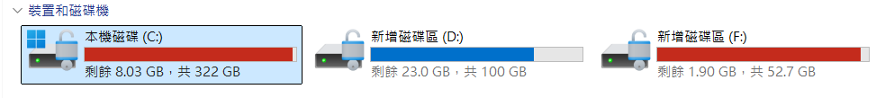

Path                                                          SizeG
                                                                  B

---

F:\UnityProjects\unity_project                                 5.88
F:\Pre_Work_AI\citysoul\unity-flutter-bridge-demo\flutter_app  6.66
F:\AndroidSDK                                                  3.91
C:\Users\jessi\.gradle                                         6.89
F:\dev\flutter                                                 0.88

| 位置                                              | 內容                                                          | 特性                        |
| ------------------------------------------------- | ------------------------------------------------------------- | --------------------------- |
| `C:\Program Files\Unity\Hub\Editor\6000.5.6f1`  | Unity Editor、Android Build Support、內建 JDK／NDK／SDK       | 通常最大                    |
| `F:\AndroidSDK`                                 | Android SDK Platform、Build-Tools、NDK、CMake、Platform-Tools | 建置必要                    |
| `F:\UnityProjects\unity_project\Library`        | Unity 匯入與編譯快取                                          | 通常非常大，可重建          |
| `F:\UnityProjects\unity_project\android_export` | Unity 匯出的 Gradle 專案                                      | Unity module 與 IL2CPP 資料 |
| `F:\...\flutter_app\build`                      | Flutter APK／Gradle 建置產物                                  | 可重建                      |
| `C:\Users\jessi\.gradle`                        | Gradle wrapper、依賴與快取                                    | 可清理但會重新下載          |
| Flutter SDK／Pub cache                            | Flutter 本身與 Dart 套件                                      | 通常中等                    |

